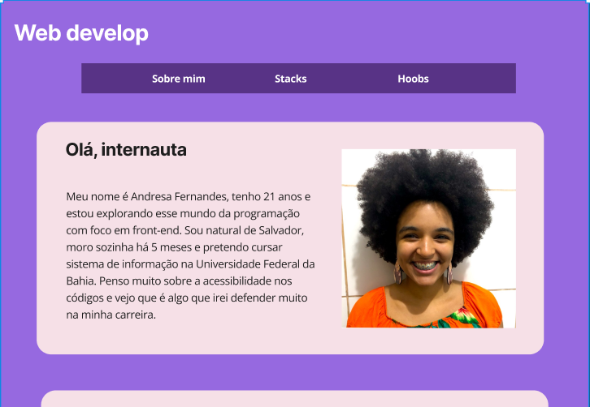

<h1 align="center"> Ada Lovelace </h1>

 

  

## 🚀 Tecnologias

Esse projeto foi desenvolvido com as seguintes tecnologias:

- HTML, CSS e JavaScript
- Git e GitHub 

## 💻 Descrição

A tela foi criada para consolidar os meus conhecimentos básicos em html, css e javascript
 
- [Acesse o projeto finalizado, online](https://andresa43.github.io/minha_biografia/)

## 🔖 Layout

Você pode visualizar o layout do projeto através [DESSE LINK](https://www.figma.com/file/Lwb7VQk1d1UGkrlD7Wr4ZU/Untitled?node-id=0%3A1&t=iJsWSzaqdSC4jrak-0). É necessário ter conta no [Figma](https://figma.com/) para acessá-lo.

## 📝 Licença

Esse projeto está sob a licença MIT.

---

Feito com ♥ Progra{m}aria 👋 [Acesse o site!](https://www.programaria.org/)
